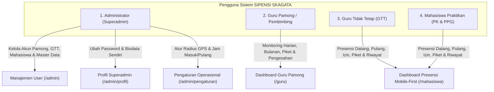
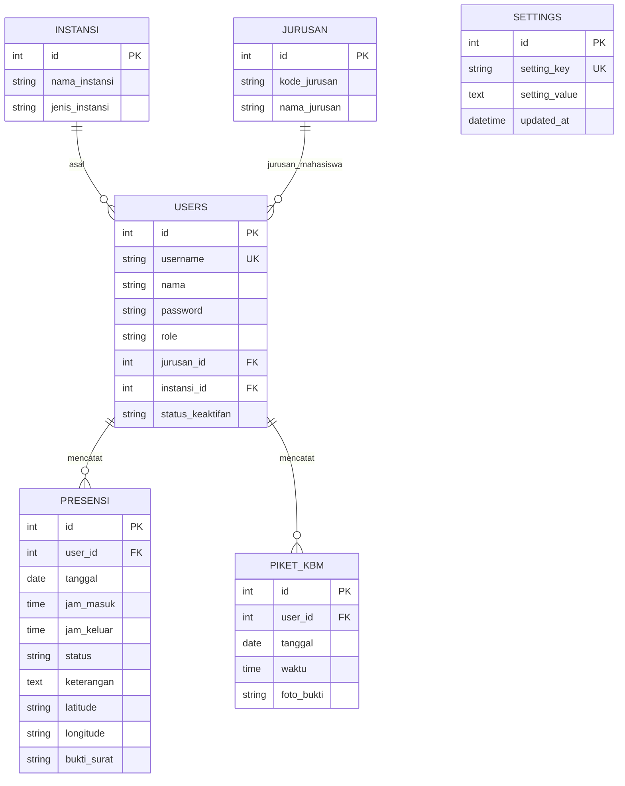

# Product Requirements Document (PRD) v2.0
## SIPENSI SKAGATA: Sistem Informasi Presensi & Piket KBM
### SMK Negeri 3 Yogyakarta (Skagata)

---

| Dokumen | Spesifikasi Kebutuhan Produk (PRD) v2.0 Resmi |
| :--- | :--- |
| **Nama Produk** | **SIPENSI SKAGATA** *(Sistem Informasi Presensi & Piket Skagata)* |
| **Ekosistem Saudara** | **SIBENKA SKAGATA** *(Sirkulasi Bengkel Skagata)* |
| **Institusi Tuan Rumah** | SMK Negeri 3 Yogyakarta (Jl. R.W. Monginsidi No. 2, Jetis, Yogyakarta) |
| **Lead Developer** | Yodi Irawan |
| **Kredit Resmi** | *Crafted with ❤️ by awanbeo.my.id* |
| **Status Dokumen** | **FINAL APPROVED v2.0** |
| **Target Implementasi** | Semester Ganjil / Genap T.A. 2026/2027 |

---

## 1. Executive Summary & Visi Produk

### 1.1 Sejarah & Latar Belakang Pengembangan
1. **Fase Awal (Jurusan Informatika)**:  
   Pada mulanya, aplikasi ini dirancang dan dibangun secara mandiri oleh pengembang untuk kebutuhan presensi mahasiswa Praktik Pengalaman Lapangan (PPL) program PPG khusus di lingkungan **Jurusan Informatika SMK Negeri 3 Yogyakarta**.
2. **Ekspansi Kebutuhan Sekolah**:  
   Melihat efektivitas sistem presensi berbasis lokasi dan jam ini, pihak sekolah meminta agar sistem diperluas penggunaannya untuk:
   * **Mahasiswa Praktik Kependidikan (PK)** dari berbagai perguruan tinggi di Yogyakarta (seperti UNY, UAD, UST, dll.) lintas jurusan kependidikan.
   * **Guru Tidak Tetap (GTT)** di lingkungan SMKN 3 Yogyakarta untuk pencatatan kehadiran mandiri dan pemenuhan jam tugas harian.
3. **Pengembangan Berkelanjutan**:  
   Pengembang terus menyempurnakan arsitektur aplikasi sejalan dengan dinamika kebutuhan operasional nyata di Skagata, menyelaraskan pola interaksi dengan aplikasi ekosistem sekolah lainnya seperti **SIBENKA SKAGATA** *(Sirkulasi Bengkel Skagata)*.

### 1.2 Visi & Nilai Tambah Produk
Menghadirkan platform presensi dan dokumentasi piket KBM yang:
* **Eksklusif untuk Skagata**: Dirancang khusus untuk ekosistem SMKN 3 Yogyakarta (bukan platform multi-sekolah umum).
* **Akurat & Anti-Kecurangan**: Penegakan perimeter GPS Geofencing (Formula Haversine) di area sekolah Skagata serta dokumentasi piket kamera langsung.
* **Akuntabel Berbasis Hari Kerja Efektif**: Laporan presensi yang transparan dan tertib berdasarkan siklus 5 hari kerja resmi (Senin s.d. Jumat). Dalam satu bulan rekapitulasi kehadiran menyajikan angka yang pasti: berapa kali Hadir, Terlambat, Izin, Sakit, dan Alpa. Hari libur (Sabtu & Minggu) serta tanggal merah libur nasional tidak dihitung sebagai ketidakhadiran / alpa.
* **Elegan, Minimalis & Mobile-First**: Antarmuka bersih bernuansa hijau khas Skagata (*Skagata Emerald*) tanpa tumpukan warna berlebihan, bebas dari ornamen/ikon generik yang mengganggu, serta dioptimalkan secara mendalam untuk kenyamanan layar smartphone (*mobile ergonomics*) bagi Mahasiswa dan GTT.

---

## 2. Struktur Pengguna & Matriks Hak Akses (RBAC)

Sistem mengadopsi 4 peran pengguna (*User Roles*) dengan pemisahan fungsionalitas yang tegas:



### 2.1 Definisi Peran Pengguna

| Peran | Kode Role | Keterangan & Lingkup Tanggung Jawab |
| :--- | :---: | :--- |
| **Administrator** | `admin` | Pengelola penuh sistem: mengelola akun Guru Pamong, GTT, dan Mahasiswa; mengelola master data jurusan mahasiswa & asal kampus; mengatur jam kerja operasional; dan mengalibrasi radius GPS sekolah. Akun admin sendiri dikelola di menu Profil Admin. |
| **Guru Pamong** | `guru_pamong` | Guru tetap Skagata yang bertindak sebagai pembimbing/supervisor. Bertanggung jawab memverifikasi kehadiran harian, meninjau bukti surat izin/sakit, mengecek foto & laporan bulanan piket, serta mengesahkan laporan presensi bulanan. |
| **Guru Tidak Tetap** | `gtt` | Guru honorer/GTT Skagata yang melakukan presensi mandiri harian (datang, pulang), piket KBM, melihat riwayat kehadirannya sendiri, dan pengajuan izin/sakit. Tampilan berorientasi mobile-first. |
| **Mahasiswa Praktikan** | `mahasiswa` | Mahasiswa PPL/PPG/PK yang melakukan absensi mandiri, dokumentasi piket KBM (kamera depan/belakang), memantau riwayat kehadiran bulanan, dan mengunggah bukti surat. Tampilan berorientasi mobile-first. |

### 2.2 Siklus Hidup Pengguna (User Lifecycle Status)

Setiap akun pengguna memiliki atribut status keaktifan:
* **`aktif`**: Pengguna sedang bertugas di Skagata. Memiliki hak akses login dan melakukan seluruh aktivitas absensi harian.
* **`alumni` / `purna_tugas`**: Mahasiswa PK/PPG yang telah ditarik kembali ke kampus atau GTT yang telah menyelesaikan masa penugasannya.
  - Akun **ditutup dari hak login** (tidak dapat mengisi presensi baru).
  - Seluruh data historis kehadiran, jam kerja, surat izin, dan foto piket di masa lalu **tetap tersimpan utuh dan permanen** di database.
  - Guru Pamong dan Admin tetap dapat melihat, memfilter, dan mencetak laporan historis mahasiswa/GTT tersebut kapan pun diperlukan.

---

## 3. Spesifikasi Fitur Fungsional

### 3.1 Identitas Sekolah & Geofencing Perimeter Skagata
* **Titik Pusat Tetap SMKN 3 Yogyakarta**:
  - Alamat: Jl. R.W. Monginsidi No. 2, Jetis, Yogyakarta.
  - Koordinat Pusat: `Latitude: -7.780120`, `Longitude: 110.366450`.
  - Identitas institusi terkunci untuk Skagata (tidak memerlukan konfigurasi multi-sekolah).
* **Radius Perimeter**:
  - Nilai bawaan: `100 meter` (mencakup seluruh area gedung barat, timur, lapangan, aula, dan bengkel kejuruan Skagata).
  - Superadmin dapat mengalibrasi radius secara visual melalui peta interaktif Leaflet.
* **Logika Validasi Haversine**:
  $$d = 2R \cdot \arcsin\left(\sqrt{\sin^2\left(\frac{\Delta\phi}{2}\right) + \cos(\phi_1)\cos(\phi_2)\sin^2\left(\frac{\Delta\lambda}{2}\right)}\right)$$
  - Jika jarak kalkulasi $d > \text{radius}$: Presensi datang ditolak dan menampilkan selisih jarak.
  - Tersedia opsi *Toleransi Darurat* (toggle bypass geofence) di panel admin jika terjadi gangguan sinyal GPS massal.

### 3.2 Ketentuan Waktu Operasional & Logika Hari Kerja Efektif
* **Jam Operasional Dinamis (Dapat Diubah Superadmin)**:
  - Jam Masuk Normal (Default: `07:15:00` WIB).
  - Jam Pulang Minimal (Default: `15:00:00` WIB).
  - Nilai waktu ini dapat disesuaikan sewaktu-waktu oleh Superadmin melalui menu Pengaturan (misal: saat bulan Ramadhan atau penyesuaian jam dinas sekolah).
  - **Banner Jam Operasional di Dashboard**: Informasi jam masuk normal dan jam pulang minimal wajib ditampilkan secara jelas dan elegan di dashboard Mahasiswa dan GTT agar pengguna mengetahui batas waktu presensi harian.
* **Kebijakan Keterlambatan**:
  - Absensi datang $\le \text{Jam Masuk Normal} \rightarrow$ Status: **`hadir`**.
  - Absensi datang $> \text{Jam Masuk Normal} \rightarrow$ Status: **`terlambat`** (otomatis tercatat dengan badge amber beraksen).
* **Pencegahan Checkout Dini**:
  - Tombol **PULANG** hanya aktif jika jam server $\ge \text{Jam Pulang Minimal}$. Percobaan pulang sebelum waktunya dicegah oleh sistem.
* **Basis Hari Kerja Efektif & Pengecualian Hari Libur / Tanggal Merah**:
  - Rekapitulasi laporan bulanan dihitung berdasarkan total hari kerja efektif (5 hari kerja: Senin s.d. Jumat).
  - Hari Sabtu dan Minggu adalah hari libur akhir pekan resmi.
  - **Hari Libur Nasional / Tanggal Merah**: Hari libur nasional atau cuti bersama yang jatuh pada hari kerja (Senin-Jumat) dikecualikan dari perhitungan hari wajib presensi, sehingga jika tidak ada presensi pada tanggal merah, sistem **tidak menghitungnya sebagai Alpa**.
  - Hari kerja efektif murni tanpa presensi dan tanpa keterangan izin/sakit barulah dihitung sebagai **`alpa`**.

### 3.3 Pengajuan Izin/Sakit & Berkas Bukti Susulan
* **Formulir Pengajuan**:
  - Pilihan status: `izin` atau `sakit`.
  - Input keterangan/alasan wajib diisi (minimal 5 karakter, maksimal 500 karakter).
  - Unggah berkas bukti (surat dokter / surat izin) bersifat **opsional** pada saat pengajuan awal.
* **Unggah Bukti Susulan**:
  - Mahasiswa dan GTT dapat melampirkan berkas susulan kapan saja melalui tombol modal di halaman Riwayat Presensi.
  - Format didukung: PDF, JPG, PNG, WEBP (maksimal 2MB).

### 3.4 Dokumentasi Piket KBM, Flip Kamera & Kompresi Foto
* **Mekanisme Pengambilan Gambar**:
  - Kamera aktif langsung melalui WebRTC MediaDevices API (tidak menggunakan upload galeri).
  - **Fitur Flip Kamera**: Pengguna dapat beralih antara **kamera depan** (`facingMode: "user"`) dan **kamera belakang** (`facingMode: "environment"`) melalui tombol switch kamera yang ergonomis di layar ponsel.
  - **Kompresi Gambar di Sisi Klien (Client-Side Compression)**: Sebelum dikirim ke server, foto hasil tangkapan kamera dikompresi otomatis via HTML5 Canvas (resolusi maksimum lebar 1280px, kualitas JPEG 75-80%) untuk menghemat kuota pengguna dan mencegah beban penyimpanan server membengkak tanpa mengurangi keterbacaan foto.
  - Kuota presensi piket: **1 kali per hari per pengguna**.
* **Watermark Otomatis**:
  - Stempel waktu otomatis: Nama Pengguna, Waktu Server, Tanggal, dan Identitas SMKN 3 Yogyakarta.
* **Pelaporan Piket**:
  - **Laporan Harian Piket**: Menampilkan daftar piket pada tanggal terpilih beserta modal foto bukti.
  - **Laporan Bulanan Piket**: Rekapitulasi total keikutsertaan piket mahasiswa/GTT dalam satu bulan berjalan untuk monitoring guru pamong.

### 3.5 Manajemen Master Data & Pengguna (Admin Panel)
* **Master Jurusan Mahasiswa**:
  - Mencatat program studi/jurusan asal mahasiswa praktikan di kampusnya (contoh: *Pendidikan Teknik Informatika*, *Pendidikan Teknik Elektro*, *Pendidikan Teknik Mesin*, *Pendidikan Teknik Otomotif*, *Bimbingan Konseling*, *Pendidikan Jasmani Kesehatan & Rekreasi*, dll.).
* **Pengaitan Guru Pamong ke Jurusan Mahasiswa**:
  - Administrator dapat mengaitkan Guru Pamong ke satu atau beberapa jurusan mahasiswa tertentu. Hal ini memudahkan guru pamong untuk memfokuskan pemantauan pada mahasiswa bimbingannya sesuai bidang keahlian.
* **Master Asal Kampus / Universitas**:
  - Data perguruan tinggi mitra: UNY, UAD, UST, PPG Prajabatan Kemendikbud, dsb., serta internal Skagata untuk GTT.
* **Manajemen Pengguna Tanpa Tombol Manual (Auto-Filter ala SIBENKA)**:
  - Filter pencarian dan dropdown (Role, Jurusan, Asal Kampus, Status Keaktifan) bekerja secara **otomatis saat opsi dipilih** (`onchange="this.form.submit()"` / reactive reload), tanpa memerlukan tombol "Terapkan" atau "Submit" manual, menjaga konsistensi rasa penggunaan dengan aplikasi *SIBENKA SKAGATA*.
* **Manajemen Akun Superadmin Terpisah**:
  - Akun superadmin tidak diutak-atik di tabel manajemen user umum; tersedia menu **Profil Saya** (`/admin/profil`) khusus untuk admin mengubah kredensial dirinya sendiri.

---

## 4. Standar Desain Sistem: Skagata Emerald Palette

### 4.1 Filosofi Visual: Elegan, Terukur & Tidak Norak
* **Prinsip Pewarnaan**: Menghindari penggunaan terlalu banyak warna dalam satu layar. Latar belakang dominan bersih dan monokromatik netral (*Soft Pearl & Slate*), dengan warna hijau khas Skagata sebagai aksen yang berkelas dan *eye-catching*.
* **Palet Warna Utama**:

| Token Warna | Nilai Hex | Peran & Penggunaan |
| :--- | :---: | :--- |
| **Skagata Emerald (Primary)** | `#0f5132` | Header navbar, tombol aksi primer, kartu sorotan |
| **Skagata Deep Forest** | `#0a3622` | Header tabel laporan resmi, hover state tombol utama |
| **Vibrant Mint (Accent)** | `#10b981` | Indikator status Hadir, lingkaran geofencing aktif |
| **Amber Gold (Accent)** | `#d97706` | Indikator status Terlambat |
| **Sky Slate (Accent)** | `#0284c7` | Indikator status Izin |
| **Soft Rose (Accent)** | `#dc2626` | Indikator status Alpa, aksi bahaya |
| **Surface Background** | `#f8fafc` | Latar belakang seluruh halaman |
| **Card White** | `#ffffff` | Konten kartu, modal dialog |
| **Slate Dark (Text)** | `#0f172a` | Tipografi judul dan teks utama |
| **Slate Muted (Text)** | `#64748b` | Keterangan pembantu dan label kecil |

### 4.2 Prinsip Mobile-First untuk Mahasiswa & GTT
* Mengingat 95% interaksi Mahasiswa dan GTT dilakukan melalui ponsel saat berada di sekolah, tata letak dashboard absensi, tombol "DATANG"/"PULANG", jam digital, kamera piket, dan riwayat presensi dirancang dengan **mobile-first ergonomics**:
  - Tombol aksi berukuran ramah sentuhan (*touch target* $\ge 48\text{px}$).
  - Jam digital berada di titik fokus utama layar tanpa scroll.
  - Kontrol kamera piket (tombol jepret & tombol flip kamera) mudah dijangkau dengan ibu jari satu tangan.
  - Kartu riwayat presensi yang dapat digulir secara vertikal dengan nyaman tanpa overflow horizontal.

### 4.3 Unified Global Navbar
* Menggantikan header lokal di setiap halaman dengan satu navbar atas yang seragam:
  - Kiri: Logo & Teks *"SIPENSI SKAGATA"*.
  - Tengah: Tautan navigasi aktif sesuai role pengguna.
  - Kanan: Nama pengguna, badge peran yang rapi, dan dropdown menu akun (Ubah Password & Logout).

### 4.4 Atribusi Resmi di Footer
Di bagian bawah seluruh halaman disematkan kredit resmi:
```html
<footer class="footer-skagata py-3 text-center">
  <div class="container">
    <span>Crafted with ❤️ by <a href="https://awanbeo.my.id" target="_blank" class="fw-semibold text-success text-decoration-none">awanbeo.my.id</a> &bull; SMK Negeri 3 Yogyakarta</span>
  </div>
</footer>
```

---

## 5. Standar Format Pelaporan Resmi (Reporting Engine)

### 5.1 Format Cetak PDF / Cetak Fisik Kedinasan
Laporan bulanan dirancang memenuhi standar administrasi sekolah saat dicetak (`window.print()` / simpan sebagai PDF):
1. **Kop Resmi Sekolah**:
   - Logo SMK Negeri 3 Yogyakarta di sebelah kiri.
   - Teks Kop Dinas:
     ```
     PEMERINTAH DAERAH DAERAH ISTIMEWA YOGYAKARTA
     DINAS PENDIDIKAN, PEMUDA, DAN OLAHRAGA
     SMK NEGERI 3 YOGYAKARTA
     Jl. R.W. Monginsidi No. 2, Jetis, Yogyakarta 55233. Telp: (0274) 513507
     ```
2. **Keterangan Rekapitulasi**:
   - Judul: *REKAPITULASI PRESENSI MAHASISWA PRAKTIKAN / GURU TIDAK TETAP*.
   - Periode: Bulan dan Tahun Penugasan.
   - Basis Perhitungan: Total Hari Kerja Efektif (Senin s.d. Jumat).
   - Filter Kategori: Jurusan Mahasiswa / Asal Perguruan Tinggi.
3. **Tabel Data Presensi Bulanan**:
   - Kolom: No, Nama Lengkap, Jurusan Asal, Asal Kampus, Hadir, Terlambat, Izin, Sakit, Alpa, % Kehadiran Efektif.
4. **Lembar Pengesahan Tanda Tangan**:
   - Sisi Kiri: Mengetahui, Koordinator PK/PPL Perguruan Tinggi.
   - Sisi Kanan: Yogyakarta, [Tanggal Cetak] &bull; Guru Pamong Pembimbing / Kepala SMKN 3 Yogyakarta.

### 5.2 Format Ekspor Spreadsheet (.xls Native)
* File terunduh bersih berekstensi `.xls` yang dapat dibuka langsung tanpa dependensi pihak ketiga.
* Menggunakan formula kalkulasi persentase otomatis dan header berwarna Skagata Emerald.
* Format penamaan file terstruktur: `Laporan_Presensi_Skagata_{Bulan}_{Tahun}.xls` dan `Laporan_Piket_Skagata_{Bulan}_{Tahun}.xls`.

---

## 6. Kamus Data & Arsitektur Database (Data Dictionary)



### 6.1 Tabel `users`
| Kolom | Tipe Data | Keterangan |
| :--- | :--- | :--- |
| `id` | INT AUTO_INCREMENT (PK) | Identifier unik pengguna |
| `username` | VARCHAR(50) UNIQUE | Username untuk otentikasi login |
| `nama` | VARCHAR(100) | Nama lengkap dan gelar pengguna |
| `password` | VARCHAR(255) | Hash password menggunakan Bcrypt |
| `role` | ENUM(`admin`, `guru_pamong`, `gtt`, `mahasiswa`) | Hak akses pengguna |
| `jurusan_id` | INT NULL (FK) | Relasi ke `jurusan.id` (jurusan asal mahasiswa) |
| `instansi_id` | INT NULL (FK) | Relasi ke `instansi.id` (kampus mahasiswa atau internal Skagata) |
| `status_keaktifan`| ENUM(`aktif`, `purna_tugas`) | Status magang/penugasan (Default: `aktif`) |

### 6.2 Tabel `jurusan` (Jurusan Mahasiswa)
| Kolom | Tipe Data | Keterangan |
| :--- | :--- | :--- |
| `id` | INT AUTO_INCREMENT (PK) | Identifier unik jurusan |
| `kode_jurusan` | VARCHAR(20) | Kode singkatan (cth: PTI, PTEL, PTM, PTO, BK, PJOK) |
| `nama_jurusan` | VARCHAR(100) | Nama lengkap program studi/jurusan |

### 6.3 Tabel `instansi` (Asal Kampus / Lembaga)
| Kolom | Tipe Data | Keterangan |
| :--- | :--- | :--- |
| `id` | INT AUTO_INCREMENT (PK) | Identifier unik instansi |
| `nama_instansi` | VARCHAR(100) | Nama kampus (UNY, UAD, UST, PPG Kemendikbud, Skagata) |
| `jenis_instansi`| ENUM(`universitas`, `internal`) | Klasifikasi instansi |

### 6.4 Tabel `presensi`
| Kolom | Tipe Data | Keterangan |
| :--- | :--- | :--- |
| `id` | INT AUTO_INCREMENT (PK) | Identifier unik catatan presensi |
| `user_id` | INT (FK) | Relasi ke pengguna |
| `tanggal` | DATE | Tanggal presensi (Y-m-d) |
| `jam_masuk` | TIME NULL | Waktu absen datang |
| `jam_keluar` | TIME NULL | Waktu absen pulang |
| `status` | ENUM(`hadir`, `terlambat`, `izin`, `sakit`, `alpa`) | Status kehadiran |
| `keterangan` | TEXT NULL | Alasan izin/sakit atau catatan guru/sistem |
| `latitude` | VARCHAR(50) NULL | Titik latitude GPS saat absen |
| `longitude` | VARCHAR(50) NULL | Titik longitude GPS saat absen |
| `bukti_surat` | VARCHAR(255) NULL | Nama berkas surat dokter/izin susulan |

### 6.5 Tabel `piket_kbm`
| Kolom | Tipe Data | Keterangan |
| :--- | :--- | :--- |
| `id` | INT AUTO_INCREMENT (PK) | Identifier unik dokumentasi piket |
| `user_id` | INT (FK) | Relasi ke pengguna |
| `tanggal` | DATE | Tanggal piket |
| `waktu` | TIME | Waktu pengambilan foto piket |
| `foto_bukti` | VARCHAR(255) | Nama berkas foto dengan stempel watermark |

### 6.6 Tabel `settings`
| Kolom | Tipe Data | Keterangan |
| :--- | :--- | :--- |
| `id` | INT AUTO_INCREMENT (PK) | Identifier pengaturan |
| `setting_key` | VARCHAR(50) UNIQUE | Kunci konfigurasi (`school_latitude`, `school_radius`, dsb) |
| `setting_value`| TEXT NULL | Nilai konfigurasi |
| `updated_at` | DATETIME NULL | Waktu pembaruan terakhir |

---

## 7. Rencana Kerja Eksekusi (Roadmap Selanjutnya)

Langkah eksekusi proyek dibagi menjadi:
1. **Penyempurnaan Tampilan UI/UX (Desain Skagata Emerald & Mobile-First)**: *(SELESAI)*
   - Unified Global Navbar di `layout/template.php` dengan brand resmi **SIPENSI SKAGATA**.
   - Redesain mobile-first untuk halaman absensi dan riwayat (Mahasiswa & GTT).
   - Fitur flip kamera (depan/belakang) dan kompresi canvas pada presensi piket KBM.
   - Auto-filter pada dropdown tanpa tombol submit manual (meniru interaksi SIBENKA).
   - Penyesuaian layout cetak resmi berkop SMKN 3 Yogyakarta dan footer kredit resmi `awanbeo.my.id`.
2. **Implementasi Master Data & Role Refinement**:
   - Penambahan tabel master `jurusan` mahasiswa dan `instansi` kampus.
   - Pemisahan peran `guru_pamong` dan `gtt`.
   - Pemisahan profil superadmin tersendiri dari manajemen user umum.
   - Penambahan laporan bulanan piket KBM.
